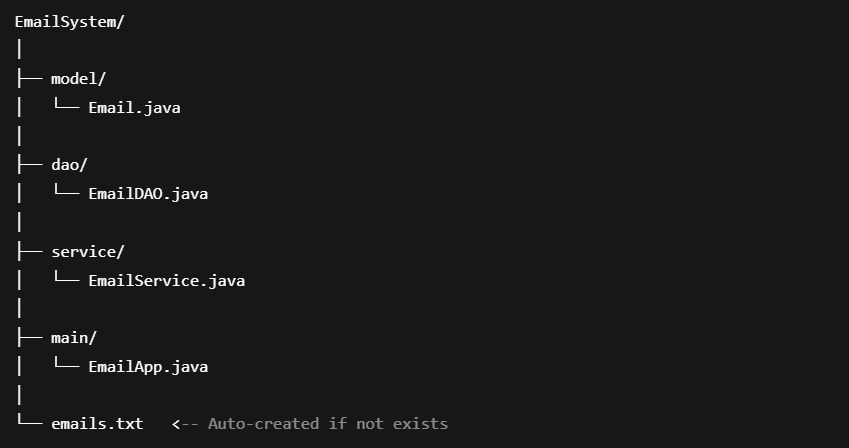
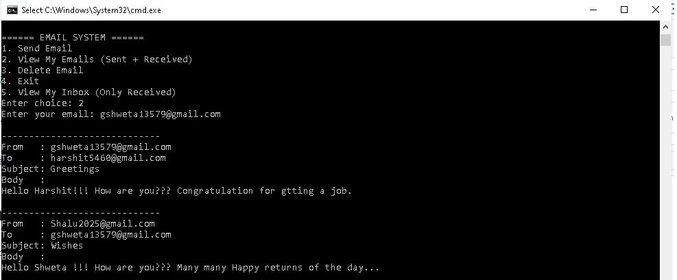
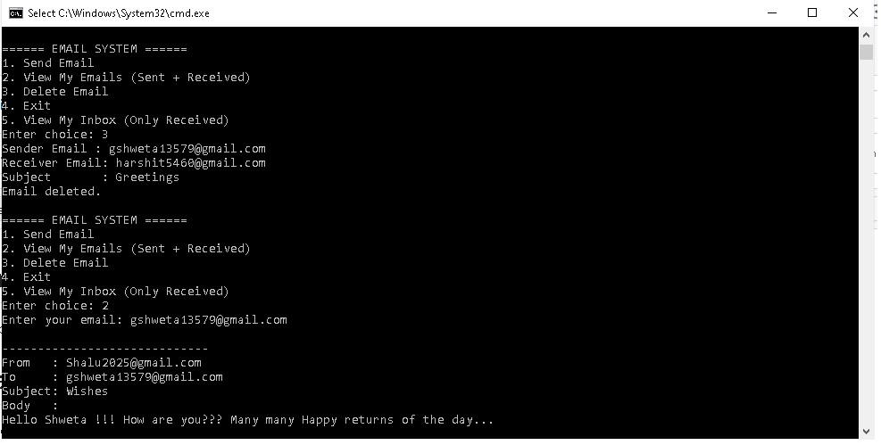
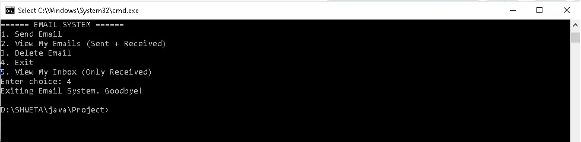

# ✉️Email-System-using-📁File-Handling-Console-based
A simple Java console-based Email System where users can compose, send, view, and delete emails. All data is stored in a local text file using File I/O. This project demonstrates OOP concepts, layered architecture, and basic CRUD operations in Java.

## 📧 Console Email System in Java

This is a simple **Console-Based Email System** developed in **Java** using **File Handling**. It simulates sending, receiving, and managing emails between users through a text-based interface.

---

## ✅ Features

### 1. Core Feature Implementation ✅

- **Compose Email**  
  Allows the user to enter sender, receiver, subject, and message to create and send an email.

- **View Inbox**  
  Displays all emails received by a specific user from the `inbox.txt` file.

- **View Sent Emails**  
  Shows all emails sent by a specific user from the `sent.txt` file.

- **Delete Sent Email**  
  Deletes a specific sent email based on the subject line from `sent.txt`.

All emails are stored as lines in text files (`sent.txt` and `inbox.txt`), simulating a basic database.

---

### 2. Error Handling and Robustness ✅

- All input and file operations are wrapped in `try-catch` blocks.
- Prevents application from crashing on invalid input or file read/write failure.
- Handles edge cases like empty inbox, email not found during deletion, etc.
- User is prompted with clear, readable error messages.

---

### 3. Readability and Modularity ✅

- Code is split into:
  - `Email` - Model class
  - `EmailDAO` - Handles file operations
  - `EmailSystemApp` - Console UI
- Each function performs a single, well-defined task.
- Consistent naming conventions and indentation.

---

### 4. Completeness of Core Features ✅

- Implements all basic email operations.
- Uses real-time timestamping for email history.
- Dual-storage (Inbox and Sent) simulates two-way communication.

---

### 5. Code Quality and Innovation ✅

- Uses:
  - `LocalDateTime` & `DateTimeFormatter` for readable timestamps.
  - `BufferedReader`/`BufferedWriter` for efficient file I/O.
- Innovative dual-file system:
  - Emails stored in both inbox and sent box to mimic real email systems.

---

### 6. Commenting and Documentation ✅

- Every class and method is documented with descriptive comments.
- Inline comments explain key logic and file-handling steps.
- Easy to read and understand for both beginners and reviewers.

---

### 7. Project Documentation ✅

- This `README.md` acts as full project documentation.
- Includes:
  - Feature list
  - Technology stack
  - Setup instructions
  - Project structure

---

# How to Use
1. Launch the application and follow the menu prompts
2. Choose an option:
   - 📩 Send Email: Compose and send an email to another user
   - 📮 View Inbox: View emails in your inbox
    - 📨View Received Emails: View emails received by you
    - 🗑️Delete Email: Delete an email from your inbox
    - 📤Exit: Quit the application

## 📁 Project Structure
    📦 ConsoleEmailSystem   
├── 📄 EmailSystemApp.java # Main entry point, contains the user interface (menu-driven)     
├── 📄 inbox.txt # File used to store received emails    
├── 📄 sent.txt # File used to store sent emails      
└── 📄 README.md # Project documentation (this file)     

# Output 
  -Composing EMAIL  
  

  -VIEW EMAILS (SEND + RECEIVE)  

  

  -DELETE EMAIL

  

  -EXIT EMAIL
  

  -VIEW EMAILS (RECEIVE)

  .jpg)  

  
